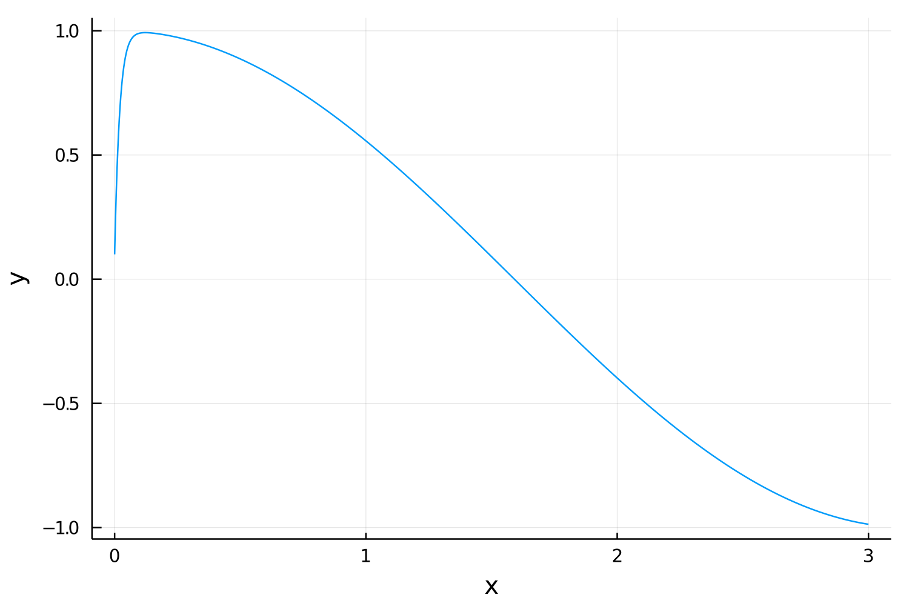

# ScalarRadau

[](https://github.com/markmbaum/ScalarRadau.jl/actions)
[](https://app.codecov.io/gh/markmbaum/ScalarRadau.jl)

Solve a stiff, *scalar* differential equation accurately and efficiently
```julia
using BenchmarkTools, ScalarRadau, Plots
F(x, y, p) = 50*(cos(x) - y);
x, y = radau(F, 0.1, 0, 3, 1000);
plot(x, y, legend=false, xlabel="x", ylabel="y");
```


```julia
x = LinRange(0, 3, 100)
y = zeros(100)
@btime radau!($y, $x, $F, 0.1, 0.0, 3.0);
  5.667 μs (2 allocations: 1.75 KiB)
```

-----

This module contains a lightweight implementation of the classic 5th order [Radau IIA method](https://link.springer.com/referenceworkentry/10.1007%2F978-3-540-70529-1_139) for a **scalar** ordinary differential equation (ODE) in Julia. The algorithm is famously effective for stiff ODEs. Implementation mostly follows the description in chapter IV.8 in [Solving Ordinary Differential Equations II](https://www.springer.com/gp/book/9783540604525), by Ernst Hairer and Gerhard Wanner, with a couple small changes that were found to be beneficial for scalar equations.

Some basic points of description:
* Step size is adaptive and the initial step size is chosen automatically.
* Functions implemented here expect to use `Float64` numbers.
* Dense output for continuous solutions is implemented using cubic Hermite interpolation.
* Approximate Jacobian evaluation is performed with a finite difference, but will use auto-differentiation as a backup
* Because the equation is scalar and the 5th order Radau method has three stages, the Jacobian is always a 3 x 3 matrix. [Static arrays](https://github.com/JuliaArrays/StaticArrays.jl) are used for efficient Newton iterations.

The implementation here is designed for a scenario where a stiff, scalar ODE must be solved repeatedly under different conditions. For example, you might need to solve the same stiff ODE with a range of different initial conditions or with many sets of system parameters. The module was originally written to solve the [Schwarzschild equation for radiative transfer](https://en.wikipedia.org/wiki/Schwarzschild%27s_equation_for_radiative_transfer) as part of [ClearSky.jl](https://github.com/markmbaum/ClearSky.jl), but it seemed like a good idea to split it off into its own repository.

The solver functions specialize directly on the ODE provided. This is slightly different than [DifferentialEquations.jl](https://github.com/SciML/DifferentialEquations.jl), which uses a two-step system of defining an ODE problem with one function then solving it with another function, but if you need to solve a stiff system of ODEs instead of a scalar equation, look [here](https://diffeq.sciml.ai/stable/solvers/ode_solve/#Stiff-Problems). Specifically, the vector implementation of the same Radau method is called [`RadauIIA5`](https://diffeq.sciml.ai/stable/solvers/ode_solve/#Fully-Implicit-Runge-Kutta-Methods-(FIRK)).

For a nice mathematical overview of Radau methods, check out: [Stiff differential equations solved by Radau methods](https://www.sciencedirect.com/science/article/pii/S037704279900134X).

### How to Use `ScalarRadau`

Install using Julia's package manager
```shell
julia> ]add ScalarRadau
```

To solve an ODE, first define it as a function, then pass it to the `radau` function.
```julia
using ScalarRadau
F(x, y, param) = -y
x, y = radau(F, 1, 0, 2, 25)
```
The snippet above solves the equation `dy/dx = -y`, starting at `y=1`, between `x=0` and `x=2`, and returns 25 evenly spaced points in the solution interval.

The "function" `F` can be any callable object, as long as it can be called with `(x, y, param)` arguments.

### In-place Solution

For full control over output points, the in-place function is

```julia
radau!(yout, xout, F, y₀, x₀, xₙ, param=nothing; rtol=1e-6, atol=1e-6, facmax=100.0, facmin=0.01, κ=1e-3, ϵ=0.25, maxnwt=7, maxstp=1000000)
```
Mandatory function arguments are
* `yout` - vector where output points will be written
* `xout` - sorted vector of `x` values where output points should be sampled
* `F` - scalar ODE in the form `F(x, y, param)`
* `y₀` - initial value for `y`
* `x₀` - starting point for `x`
* `xₙ` - end point of the integration

The optional `param` argument is `nothing` by default, but it may be any type and is meant for scenarios where extra information must be accessible to the ODE function. It is passed to your ODE function whenever it's evaluated.

The coordinates of the output points (`xout`) should be between `x₀` and `xₙ` and they should be in ascending order. They are not checked for integrity before integrating, though. The only check performed is `xₙ > x₀`, or that the integration isn't going backward.

Keyword arguments are
* `rtol` - relative error tolerance
* `atol` - absolute error tolerance
* `facmax` - maximum fraction that the step size may increase, compared to the previous step
* `facmin` - minimum fraction that the step size may decrease, compared to the previous step
* `κ` (kappa) - stopping tolerance for Newton iterations
* `ϵ` (epsilon) - fraction of current step size used for finite difference Jacobian approximation
* `maxnwt` - maximum number of Newton iterations before step size reduction
* `maxstp` - maximum number of steps befor the solver stops and throws an error

Two other functions are available to make different output options convenient. Both of them use the in-place version internally.

### Evenly Spaced Output

For evenly spaced output points (as in the example above) the function definition is

```julia
radau(F, y₀, x₀, xₙ, nout, param=nothing; kwargs...)
```

In this case, you must specify the number of output points with the `nout` argument. Keyword arguments and default values are the same as above. Solution vectors for `x` and `y` are returned.

### End-point Output

To compute only the `y` value at the end of the integration interval (`xₙ`), the function is
```julia
radau(F, y₀, x₀, xₙ, param=nothing; kwargs...)
```
Again, keyword arguments and default values are identical to the in-place function.
